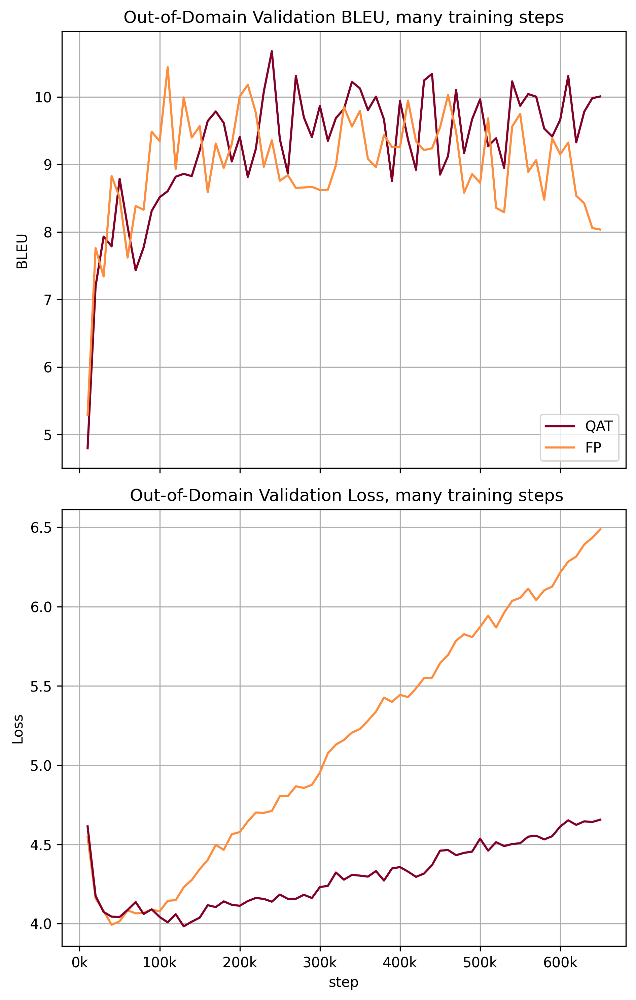

# One Bit at a Time: Impact of Quantisation on Neural Machine Translation

*Despite the precision of the large language models, the deployment of these models still faces some practical issues. Except for being memory-demanding, the main issue lays in the speed of prediction. In the case of generative language models, the time of auto-regressive generation scales with the output length. Another significant limitation of translation models remains in their domain-specificity given by the domain of the training data.*
    
*Our work investigates the impact of model quantization on these issues. In theory, quantisation holds a potential to address these problems through lower bit-width computations allowing for model compression, speed-up, and regularization incorporated in training. Specifically, we inspect the effect that quantization has on Transformer neural language translation model.*
    
*In addition to the obtained measurements, the contributions of this work are also in the implementations of quantized Transformer and the reusable framework for evaluation of speed, memory requirements, and distributional robustness of generative language models.*

# Work outcome:
* evaluation framework
    * should allow for evaluation of: NMT quality by at least one metric, inference speed, generating a summary on chosen domains
* implementation
    * at least one method of NMT speed-up: quantization, distilation, adaptive inference
* comparison
    * of quality/speed of implemented methods on various domains


## Repository Structure

* **enmt/modified_transformers_files** contains modified files of `🤗 Transformers` library

filename | QAT | SQ | DQ | SiLU | ReLU | Embeddings Quant.
:------------ | :-------------| :-------------| :------------- | :------------- | :------------- | :------------- 
modeling_marian_ORIG.py |  |  | :white_check_mark: |  |  | |
modeling_marian_quant_v2.py | :white_check_mark: |  :white_check_mark: | :white_check_mark: | :heavy_check_mark: | | |
modeling_marian_quant_v2.1.py | :white_check_mark: |  :white_check_mark: | :white_check_mark: | :heavy_check_mark: | | :heavy_check_mark:|
modeling_marian_quant_v3.py | :white_check_mark: |  :white_check_mark: | :white_check_mark: | | :heavy_check_mark: | :heavy_check_mark: |

This files need to be **manually** replaced in editable `🤗 Transformers` installation (as in requirements.txt).

## Instalation notes
 
* in some cases it is needed to have **PyTorch installed ahead of this repo**
    * tested PyTorch version: 1.11.0.dev20210929+cu102

* there might be some non-linux compatible libraries (e.g. pywin*), just skip them when it fails...

```bash
python3 -m venv venv
source venv/bin/activate
pip install -r requirements.txt
```

## Reproducing results:

This repo contains all the scripts we used in our experiments. 
The experiments and their scripts:

### Choice of Hyper-Parameters:
* runnerFineTuneFPexposureBiasEuParl*
* runnerFineTuneQATexposureBiasEuParl*

QAT Hyper-Params.            |  FP Fine-Tuning Hyper-Params.
:-------------------------:|:-------------------------:
  |  
  
### Impact of Pretraining on Domain Robustness and Accuracy
* runnerTrainFPnormalEuParl*
* runnerFineTuneQATfind*
* these scripts need to have proper paths set up (so that QAT can access FP checkpoints)

FP Training            |  QAT Continuation
:-------------------------:|:-------------------------:
  |  

### Regularization Effects of Quantization-Aware Training
* runnerFineTuneFPinf*
* runnerFineTuneQATinf*

In-Domain            |  Out-of-Domain
:-------------------------:|:-------------------------:
  |  

### Comparison of Quantized and Full Precision Models
* runnerCompareSpeed*
* QAT comparison script needs to point on QAT pretrained model


| **AMD Ryzen 5 3600, NVIDIA GeForce GTX 1660 Super 6GB**                              
| **model**                                                  | **Batch s.** | **in-d. test BLEU** | **out-d. test BLEU** |
|--------------------------------------------------------|---------:|---------------------------:|----------------------------:|
| FP CUDA                                                |        8 |                      37.15 |                       11.70 |
| FP CPU                                                 |        8 |                      37.15 |                       11.70 |
| DQ CPU                                                 |        8 |                      37.06 |                       11.63 |
| QAT CPU                                                |        8 |                      37.34 |                       11.52 |


| model                                               | Batch s. | Samples/second | Speed-Up vs. FP CPU | Speed-Up vs. CUDA |
|-----------------------------------------------------|---------:|---------------:|-------------------------------:|-----------------------------:|
| FP CUDA                                             |        8 |          16.25 |                                |                              |
| FP CPU                                              |        8 |           2.94 |                                |                         0.18 |
| DQ CPU                                              |        8 |           5.41 |                           1.84 |                         0.33 |
| QAT CPU                                             |        8 |           4.90 |                           1.67 |                         0.30 |

| model | size [MB] | compression |
|-------|----------:|------------:|
| QAT   |    173.55 |        0.57 |
| SQ    |    173.55 |        0.57 |
| DQ    |    200.63 |        0.66 |
| FP    |    301.94 |             |


### Running scripts
In our experiments we rely on `comet_lm` reporting. 
You can run any experiment like so:

```bash
COMET_API_KEY=your_comet_api_key CUDA_VISIBLE_DEVICES=1 python runnerFineTuneFPexposureBiasEuParl-1.py
```

**Some experiments rely on previously trained models**, so the scripts need to be modified to point to trained models.
We advise you to check paths, these paths in script are set in two ways:

* set variables `saved_model` or simillar (in some scripts it is variable `checkpoints_dir`)
* set `'output_dir': "pipeline/outputs/path"`

## Prototypes:

We used these notebooks to understand model quantization and to prototype `enmt` framework.

### Evaluation of pretrained model 
[Jupyter notebook](examples/train_and_eval/eval_pretrained.ipynb)

INT8 quantized model(MarianMT) has nearly same BLEU score and is 1.7times faster than in FP


### GLUE Bert Quantization
[Jupyter notebook](examples/glue_quantization/notes_examples.ipynb)

from: https://pytorch.org/tutorials/intermediate/dynamic_quantization_bert_tutorial.html


### Loding and quantization of pretrained models
[Jupyter notebook](examples/loadings/pretrained_model_quant.ipynb)

Also contains dataset preprocessing

